# Welcome to 3Deforms. Sample and 3D mesh package.

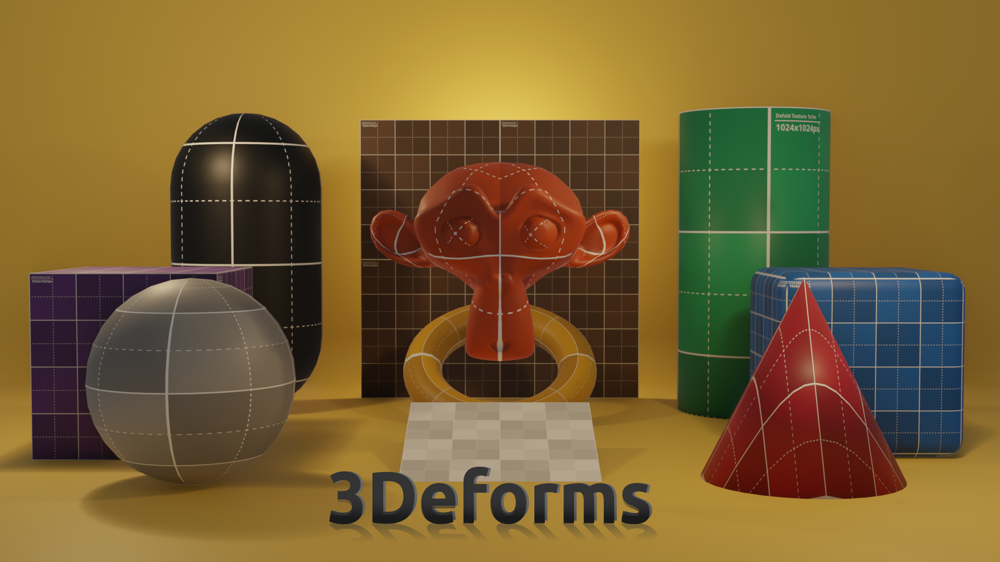

This project was created from the "empty" project template.
In Defold version 1.9.2.

This project contains 3D meshes in their simplest shapes and prototype textures in basic colors that will help you model your next 3D video game.

Note: To add 3D collision shapes, physics must be enabled in 3D mode in
["game.project"](defold://open?path=/game.project) Physics tab.

### Don't worry about the UV's!

All UV's are oriented as best as possible and compared in two 3D modeling programs to correctly apply textures.

---

## It contains the following:

3D meshes in DAE format.

3D meshes in glTF format.

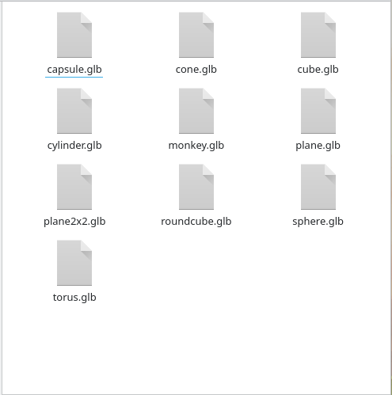

HD Prototype Texture Pack in PNG format.

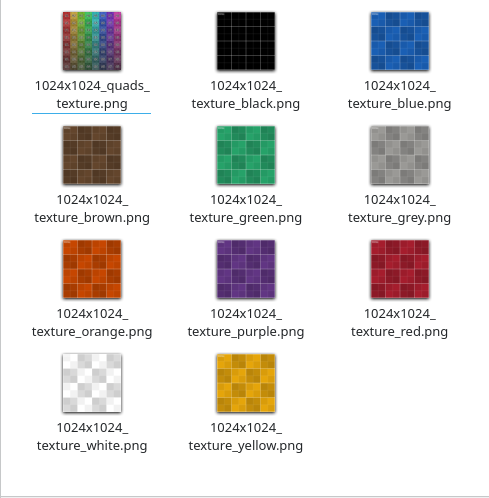

---

### Shapes and sizes:

- Cube              1x1m.
- Rounded cube      1x1m.
- Capsule           2x1x1m.
- Cone              1x1m.
- Cylinder          2x1m.
- Monkey            1x1m.
- Torus             1x1m.
- Plane             1x1m.
- Plane             2x2m.

---

### Texture Colors and Sizes:

- Quads             1024x1024px.
- White             1024x1024px.
- Black             1024x1024px.
- Gray              1024x1024px.
- Red               1024x1024px.
- Yellow            1024x1024px.
- Brown             1024x1024px.
- Blue              1024x1024px.
- Orange            1024x1024px.
- Purple            1024x1024px.

---

## How to use it?

Create an empty project.

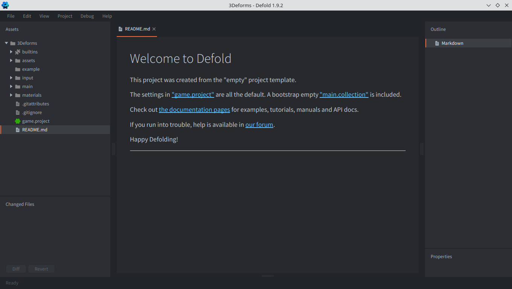

Create a collection.

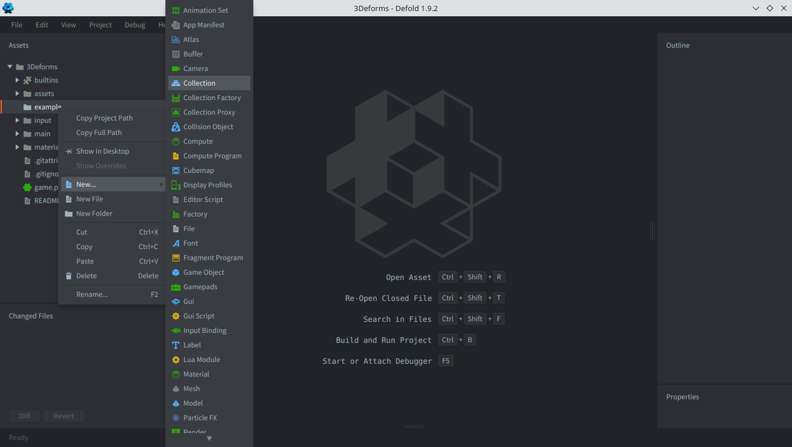

Add a node (game object).

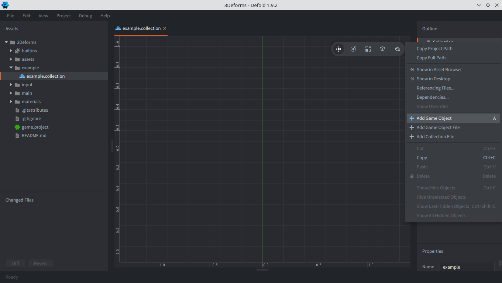

Add a model to the node (can be DAE or glTF).

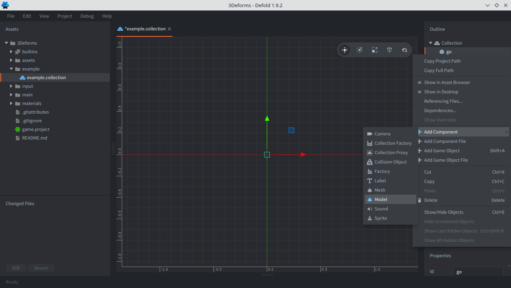

Select it from the preset folders.

Add the base material to the model.

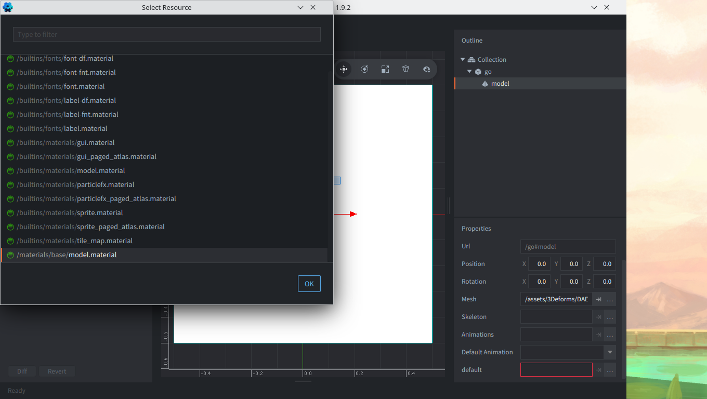

Add the main texture.

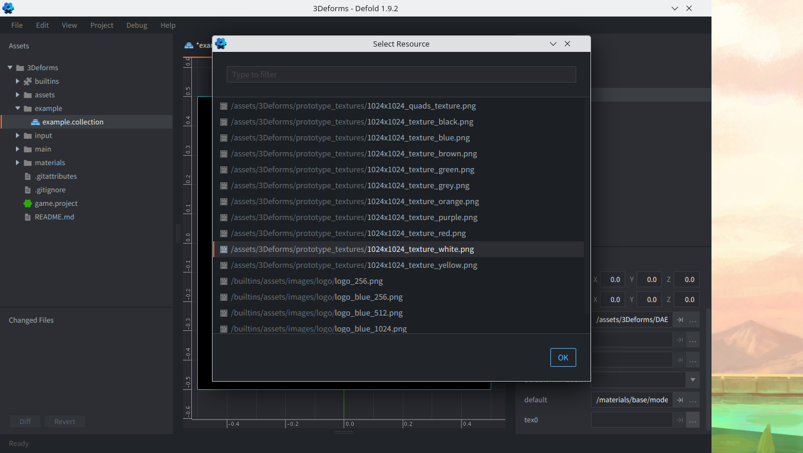

Place it to your liking.

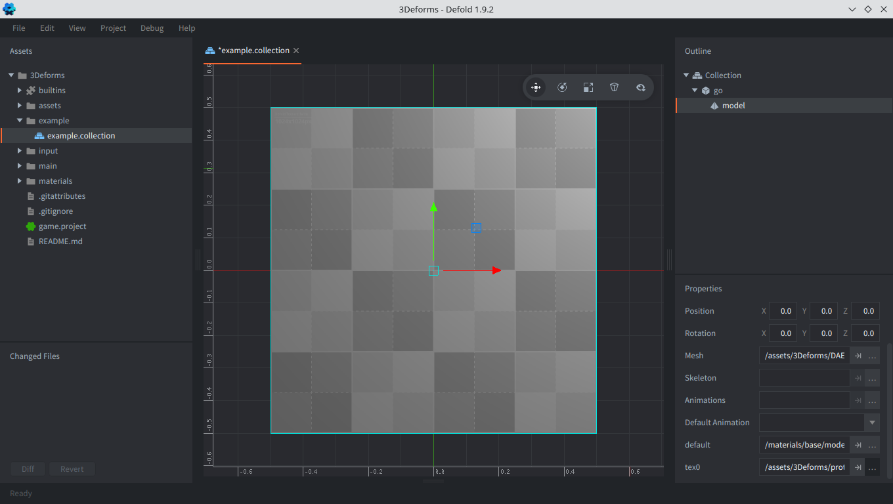

### Well done!

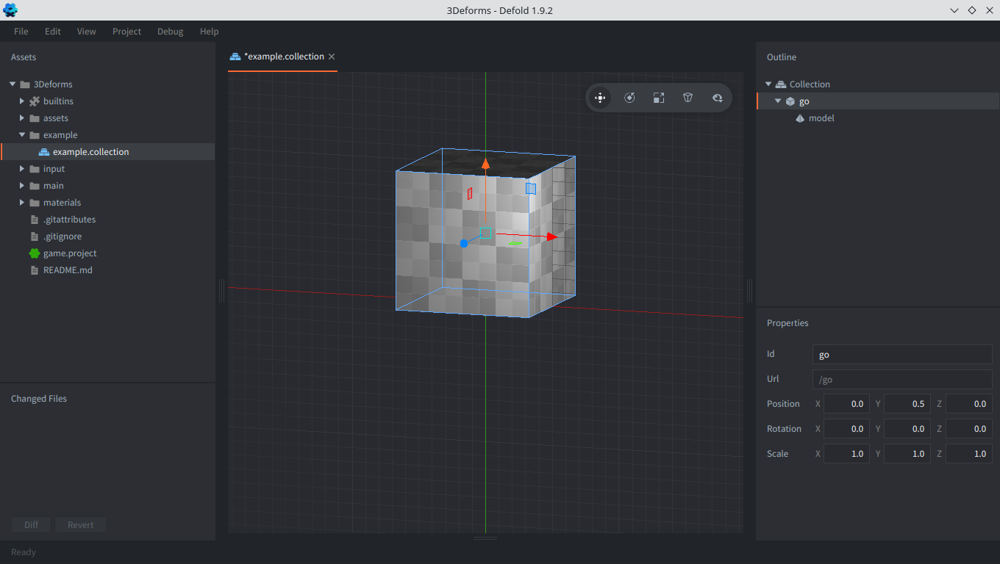

Happy Defolding!

---

PS: All images have been created for illustrative purposes.
